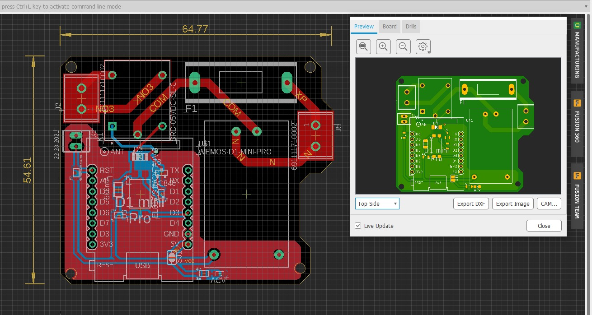
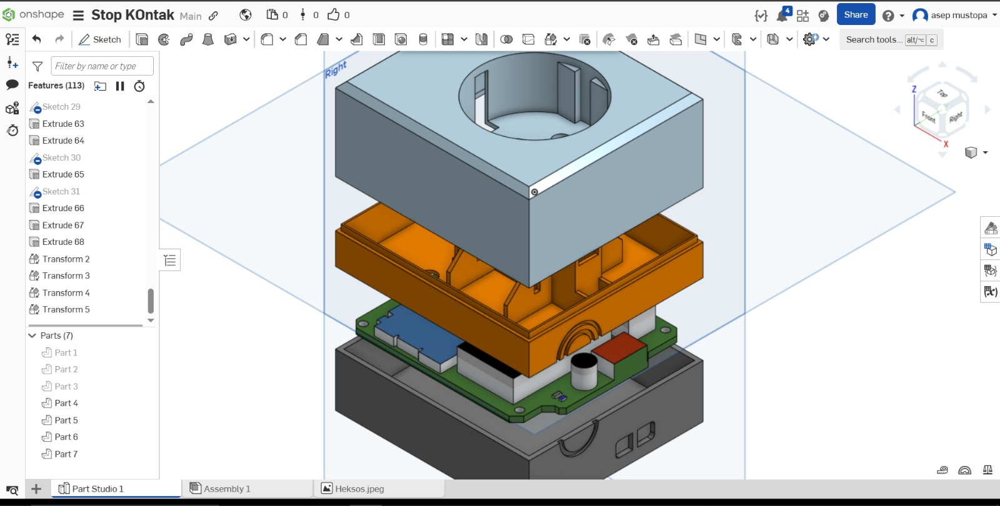
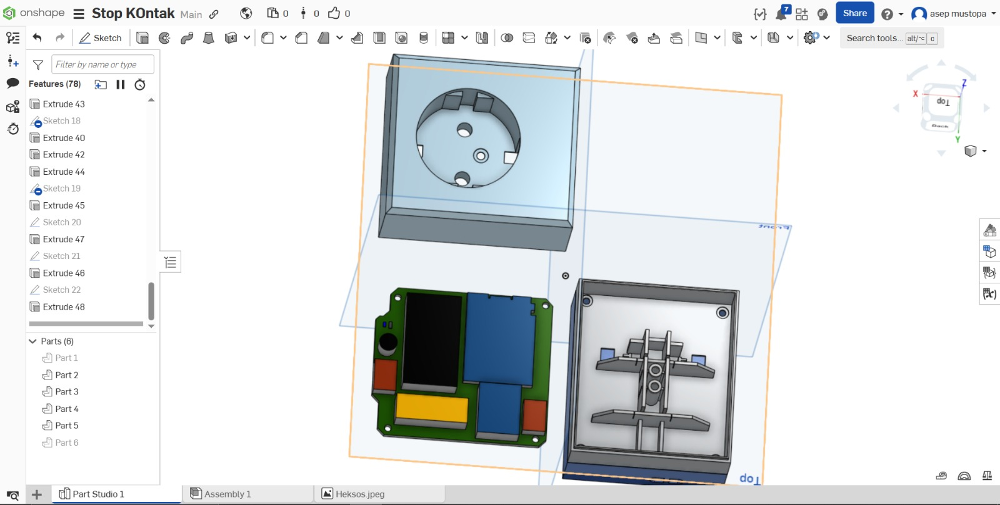
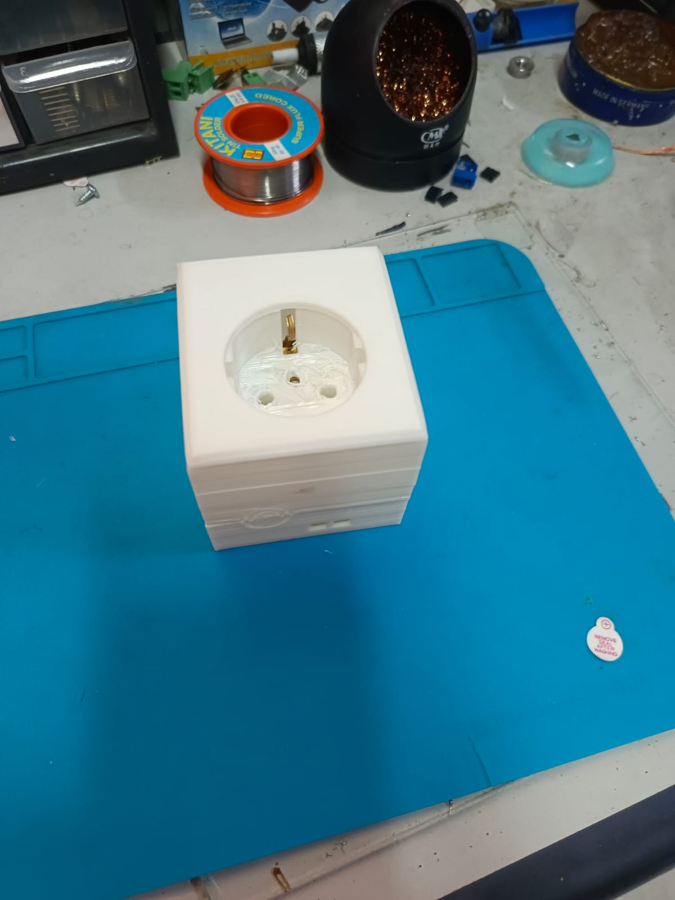

# SmartPlug
---

# 📖 Overview

This project is an IoT Smart Plug designed specifically for remote control of electrical outlets. In the development of this project, it was used to control a Hexos fan based on room temperature and humidity conditions.

This project is an independently developed solution to help industries monitor environmental conditions in specific rooms in real time. The following tools and technologies were used in its development:

- PCB Design using Autodesk EAGLE
- Component selection
- 3D Case Design with Onshape
- Mechanical assembly
- Prototype fabrication
- Firmware development using ESP8266 (Wemod D1 Mini)

The project demonstrates end-to-end embedded product development from concept to working hardware.

---
## Project Preview

### PCB Layout

### 3D Enclosure

### Results

---
